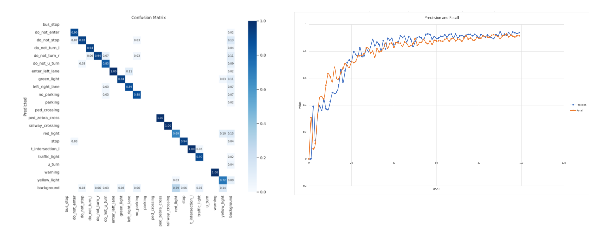
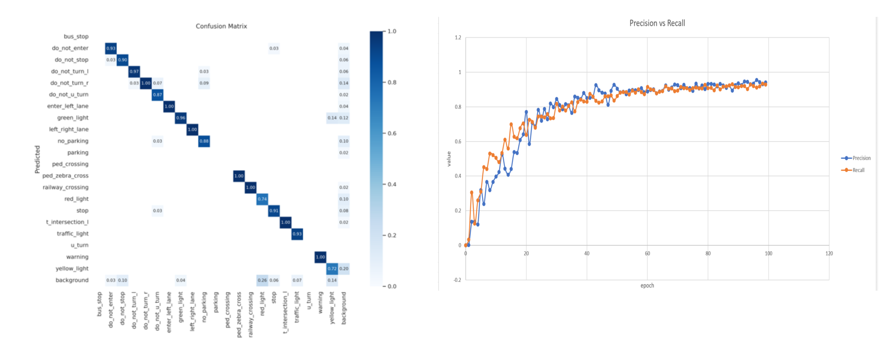
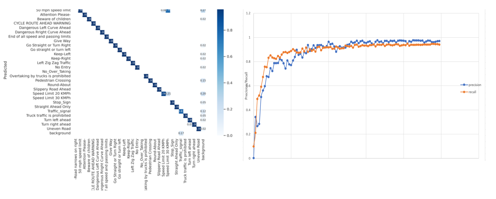
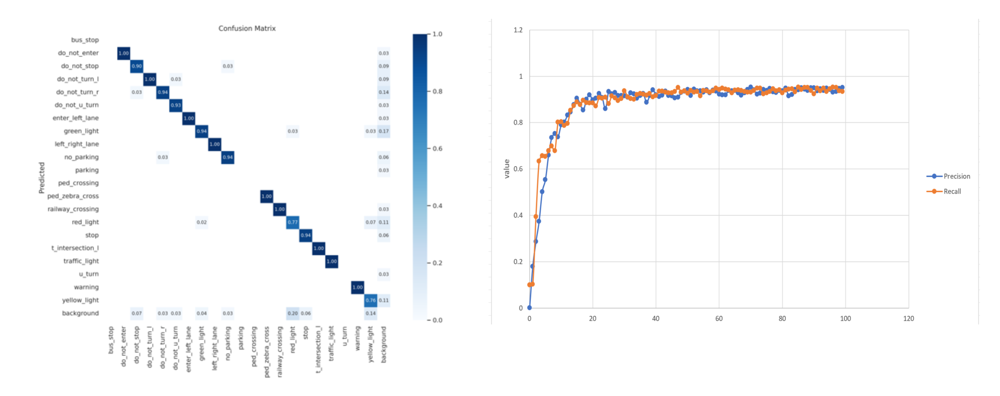
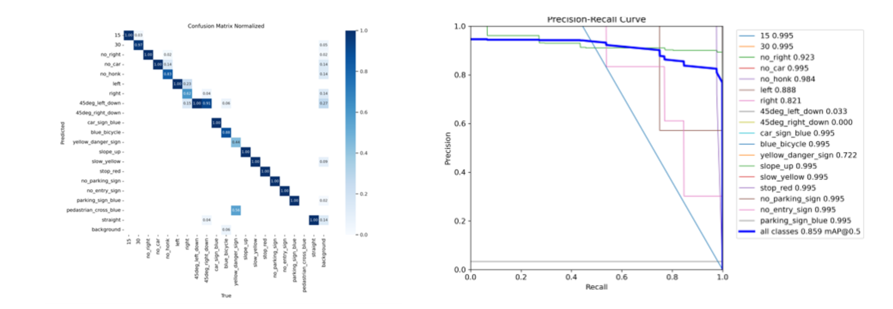
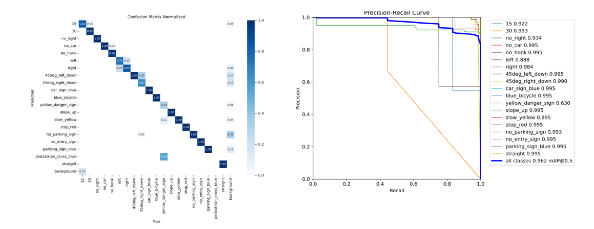
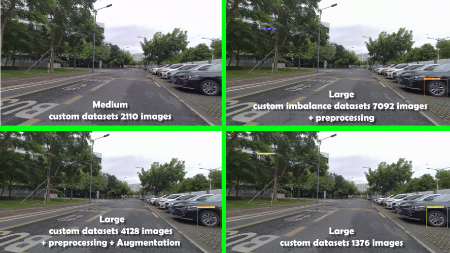
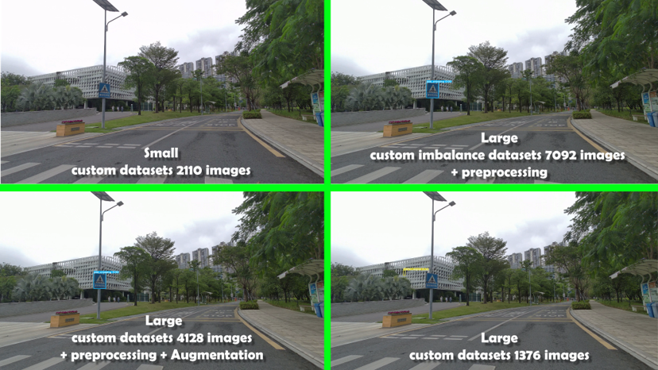

# Traffic-Sign Detection and Recognition
This project is the final group project of Machine Learning (CS405) SUSTech Fall 2023 taught by [Prof. Hao Qi](https://www.sustech.edu.cn/en/faculties/haoqi.html). I migrated the works and results from our previous local space to this repository for better documentation. Our team members are:
1. Anthony Bryan
2. Fitria Zusni Farida
3. Nguyen Thanh Lam
4. Ryan Tang Tze Hou

## Background
Traffic-sign detection and recognition refer to the technology and processes used to identify and interpret various road signs and signals in the context of intelligent transportation systems (ITS) and autonomous vehicles. This vital field plays a crucial role in enhancing road safety, improving traffic management, and enabling the successful deployment of autonomous vehicles. This project aims to delve into the intricacies of Traffic-Sign Detection and Recognition, ultimately developing and deploying a custom deep neural network to address real-world scenarios.

## Objectives
1. Based on the research, we will meticulously evaluate the various models and select the most suitable one to implement for this project. The chosen model should exhibit the potential for real-world applicability and robust performance
2. Building upon the selected model, we will actively seek opportunities to enhance its performance. This may involve fine-tuning parameters, implementing innovative algorithms, or exploring novel techniques to optimize Traffic-Sign Detection and Recognition.

## Tasks
- **Task 1**: Identify existing models, datasets, and benchmarking methodologies. Evaluate the strengths and weaknesses of different approaches. Choose a suitable deep neural network architecture for Traffic-Sign Detection. Justify the selection based on research findings and project requirements.
- **Task 2**: Evaluate the trained model's performance using appropriate metrics such as accuracy, precision, recall, and F1 score. Test the model on real-world traffic sign images or video streams to assess its robustness and reliability.

## Methodology

### Datasets
The datasets used are specified as follow:
1. **Dataset-0**
    - Source: [Roboflow](https://universe.roboflow.com/roboflow-100/road-signs-6ih4y/dataset/2)
    - Number of data: 2093 images
    - Dataset splitting: 66% training set, 23% cross-validation set, and 11% test set.
2. **Dataset-1**
    - Source: [Roboflow](https://universe.roboflow.com/usmanchaudhry622-gmail-com/traffic-and-road-signs/browse?queryText=&pageSize=200&startingIndex=450&browseQuery=true)
    - Number of data: 10000 images
    - Dataset splitting: 71% training set, 19% cross-validation set, and 10% test set.
3. **Dataset-2**
    - Source: [Roboflow](https://universe.roboflow.com/33221302-adi-novitarini-putri-ksp6l/tubes_5_augment/dataset/1)
    - Number of data: 4845 images
    - Dataset splitting: 71% training set, 19% cross-validation set, and 10% test set.
4. **Custom dataset**: 
    - Combined traffic sign datasets from CIFAR, NLPR, and several Roboflow projects.
    - Deleted some not commonly used signs.
    - Added more traffic signs in a certain class to see the effect of class balance/ imbalance.
    - Added some data augmentation to certain classes for allowing machine to learn more complex patterns.
    
The dataset distribution can be observed as following.

.png)

### Models 
This project will utilize [YOLO v8](https://github.com/haermosi/yolov8) (You Look Only Once version 8) pretrained model to detect and recognize traffic-sign. This model implemented neural network architecture which consist three parts: (1) Backbone Network, (2) Neck and Head Structures, and (3) Detection Head. The models to be experimented are as follow: 

🟨**YOLO v8n**: This model is the most lightweight and rapid in the YOLOv8 series, designed for environments with limited computational resources. YOLOv8n achieves its compact size, approximately 2 MB in INT8 format and around 3.8 MB in FP32 format, by leveraging optimized convolutional layers and a reduced number of parameters. 

🟦**YOLO v8s**: Contains approximately 9 million parameters. This model strikes a balance between speed and accuracy, making it suitable for inference tasks on both CPUs and GPUs. It introduces enhanced spatial pyramid pooling and an improved path aggregation network (PANet), resulting in better feature fusion and higher detection accuracy, especially for small objects.

🟪**YOLO v8m**: With around 25 million parameters, YOLOv8m is positioned as a mid-tier model, providing
an optimal trade-off between computational efficiency and precision. It is equipped with a more extensive
network architecture, including a deeper backbone and neck, which allows it to excel in a broader range of
object detection tasks across various datasets. This model is particularly well-suited for real-time applications
where accuracy is paramount, but computational resources are still a concern

🟩**YOLO v8l**: Boasts approximately 55 million parameters, designed for applications that demand higher precision. It employs a more complex feature extraction process with additional layers and a refined attention mechanism, improving the detection of smaller and more intricate objects in high-resolution images.

## Experimental Setup
The models will be experimented with following datasets.
- **Experiment-0**: 🟦YOLO V8s + Dataset-0
- **Experiment-1**: 🟩YOLO V8l + Dataset-0
- **Experiment-2**: 🟩YOLO V8l + Dataset-1
- **Experiment-3**: 🟩YOLO V8l + Dataset-2
- **Experiment-4**: 🟨YOLO V8n + Custom Dataset
- **Experiment-5**: 🟦YOLO V8s + Custom Dataset

In addition, we will test the model to the video stream we recorded around campus with 🟦YOLO v8s, 🟪YOLO v8m, and 🟩YOLO v8l trained on the Custom Dataset.

### Training Resources
In this experiment, because of the large datasets that require much time and resources to train and test the model, we will use Google Collab to train our ML model. Initially, we used the Tesla 4 (T4) GPU to train the
model. However, as the limit of time and the datasets are large, we decided to upgrade the GPU for faster training. The GPU we use for this time is the **NVIDIA A100**.

### Model Evaluations
Evaluated models using: **confusion matrix**, **recall**, and **precision**.

## Results

- **Experiment-0**: 🟦YOLO V8s + Dataset-0

- **Experiment-1**: 🟩YOLO V8l + Dataset-0

- **Experiment-2**: 🟩YOLO V8l + Dataset-1

- **Experiment-3**: 🟩YOLO V8l + Dataset-2

- **Experiment-4**: 🟨YOLO V8n + Custom Dataset

- **Experiment-5**: 🟦YOLO V8s + Custom Dataset

Additionally, we tested the model in the stream video we recorded around campus. Here are results on some footages of the videos.

- Footage 1

- Footage 2

- Footage 3

- Footage 4

## Conclusion

### Analysis
- 🟦YOLOv8m
    - Trained on Custom Dataset of 1001 images.
    - Outperformed smaller models.
    - Demonstrated strong accuracy in identifying traffic signs in videos.
    - Highlights the effectiveness of larger models for video and image understanding.
- 🟩YOLO8l
    - Initially trained on a custom dataset of 7092 images with preprocessing.
    - Exhibited false positives and negatives in video testing, likely due to dataset imbalance favoring majority classes.
    - Training on a smaller custom dataset of 4128 images with additional preprocessing and augmentation improved performance.
    - Despite improvements, some traffic signs were still misclassified.

### Key Observations
- Larger models like YOLOv8l can struggle with traffic sign detection in videos without adequate preprocessing and augmentation.
- Dataset quality and balance significantly impact model performance.
- Augmentation and preprocessing enhance performance but don’t fully address misclassification issues.

### Conclusion
- YOLOv8m performs well overall.
- YOLOv8l shows promise with augmentation and preprocessing but requires further refinement.
- Addressing overfitting and exploring the impact of dataset characteristics can improve model reliability and accuracy.

## References
1. Ultralytics. (n.d.). Ultralytics GitHub repository. Retrieved from https://github.com/ultralytics/ultralytics?ref=blog.roboflow.com
2. Roboflow. (2023). What's new in YOLOv8? Retrieved from https://blog.roboflow.com/whats-new-in-yolov8/#:~:text=YOLOv8%20was%20launched%20on%20January%2010th%2C%202023
3. Ultralytics. (n.d.). Ultralytics documentation. Retrieved from https://docs.ultralytics.com/
4. Roboflow. (n.d.). What is an anchor box? Retrieved from https://blog.roboflow.com/what-is-an-anchor-box/
5. Bochkovskiy, A., Wang, C.-Y., & Liao, H.-Y. M. (2020). YOLOv4: Optimal speed and accuracy of object detection. arXiv. Retrieved from https://arxiv.org/abs/2007.14917
6. Yasin, M. (2024). What is YOLOv8: An In-Depth Exploration of the Internal Features of the Next-Generation Object Detector. Retrieved from https://arxiv.org/abs/2408.15857

    
    

